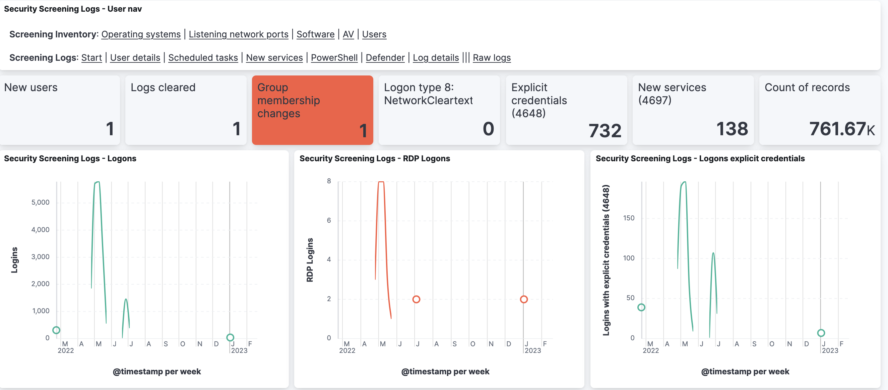
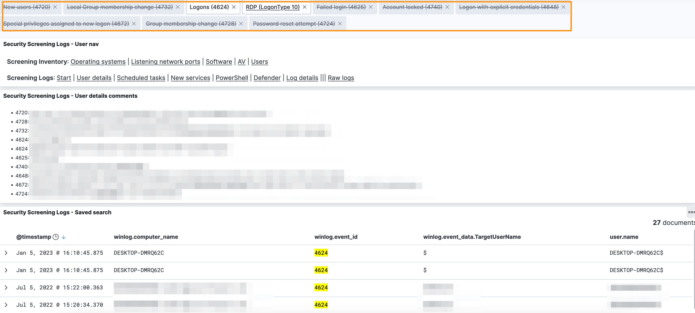
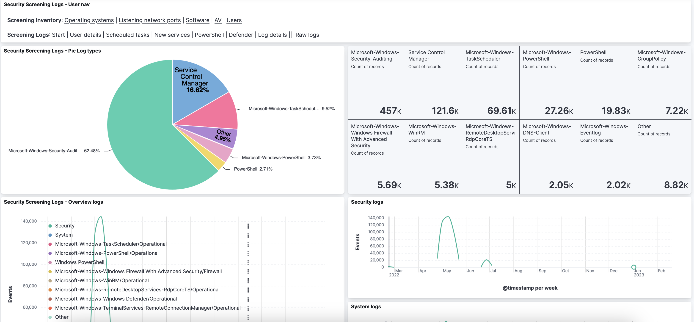
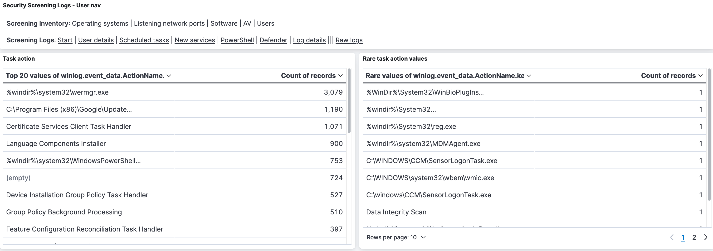
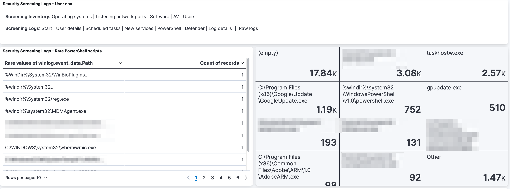

- [Security Onion for Security Screening](#security-onion-for-security-screening)
- [Prepare SecurityOnion for security screening](#prepare-securityonion-for-security-screening)
  - [Download ISO](#download-iso)
  - [Prepare](#prepare)
    - [Prepare VM](#prepare-vm)
    - [Prepare Analyst workstation](#prepare-analyst-workstation)
    - [Processing ISO](#processing-iso)
  - [Install VM](#install-vm)
  - [Set the correct keyboard](#set-the-correct-keyboard)
  - [Install GUI for analyst](#install-gui-for-analyst)
  - [Firewall access](#firewall-access)
  - [Create an Elastic API key](#create-an-elastic-api-key)
  - [Elastic interface](#elastic-interface)
  - [Deleting older indexes](#deleting-older-indexes)
  - [Security Onion security advisories](#security-onion-security-advisories)
  - [Move /nsm to separate disk](#move-nsm-to-separate-disk)
- [Setup Processing environment](#setup-processing-environment)
  - [Install tooling](#install-tooling)
  - [Security Onion sudo](#security-onion-sudo)
  - [Python virtual environment](#python-virtual-environment)
  - [Configuration file](#configuration-file)
  - [Enable the Python virtual environment](#enable-the-python-virtual-environment)
  - [Import the Kibana saved objects](#import-the-kibana-saved-objects)
  - [Chainsaw](#chainsaw)
  - [Directories](#directories)
- [Execute processing of security screening files](#execute-processing-of-security-screening-files)
  - [Process screening results](#process-screening-results)
  - [List screening results](#list-screening-results)
  - [Delete screening results](#delete-screening-results)
  - [Delete log files](#delete-log-files)
  - [Create a text report](#create-a-text-report)
- [Security Screening Logs](#security-screening-logs)
  - [Dashboards](#dashboards)
  - [Default dashboard and time frame](#default-dashboard-and-time-frame)
  - [Elastic queries](#elastic-queries)
- [Security Onion system administration](#security-onion-system-administration)
  - [Logs](#logs)
  - [Updates](#updates)
  - [Changing Web Access URL](#changing-web-access-url)

# Security Onion for Security Screening

Use Security Onion to represent data coming from a security screening. This will display the asset information from the auditscript, as well as import the most import Windows (EVTX) log files in Security Onion.


# Prepare SecurityOnion for security screening

## Download ISO

Download the latest ISO from [https://github.com/Security-Onion-Solutions/securityonion/blob/master/VERIFY_ISO.md](https://github.com/Security-Onion-Solutions/securityonion/blob/master/VERIFY_ISO.md) and verify its signature as described by Security Onion. Store the ISO on the datastore of the ESXi (or where the VM is hosed).

## Prepare

### Prepare VM

Setup a new VM with these specifications

- Guest OS family and version: Linux, **CentOS 7** (64-bit)
- 4 virtual cores
- Memory: Minimum **24GB** RAM
- Disk: Minimum **250GB** disk space
- Two network interfaces
- Point the CD-ROM to the Security Onion ISO file

For the installation also need
- One **fixed** IPv4 address
- A user account for Security Onion ('admin')
- A user account for the web interface of Security Onion (an e-mail address)
- Choose a strong password for both accounts. Remember that during installation the keyboard layout is querty.

Configure these firewall rules on your network
- Inbound SSH (tcp/22) from the administration host
- Inbound HTTPS (tcp/443) for all other users that require access to the web interface

### Prepare Analyst workstation

You need an SSH client on the analyst workstation that you use for administrating Security Onion. It is advised to use MobaXTerm which can be downloaded from [https://mobaxterm.mobatek.net/download-home-edition.html](https://mobaxterm.mobatek.net/download-home-edition.html).

Download MobaXTerm from the analyst workstation.

### Processing ISO

Because the VM is going to be airgapped (without Internet connectivity) you need a way to get the tools used for processing the logs on the VM.

Create an ISO with the content of this repository, together with a prepared Python virtual environment. Store this ISO on the datastore of the ESXi (or where the VM is hosed).

1. Create an ISO image of the tar.gz with all data: `mkisofs -o security-screening.iso security-screening.tar.gz`

## Install VM

Choose the first option in the Security Onion installer and confirm the installation by pressing enter. After a few seconds you have to confirm this choice with **yes**. Provide an administrative user (for example `analyst`) and password. Note that the default keyboard layout is querty.

The initial install of the operating system only takes a couple of minutes after which you have to reboot. After the reboot login with the administrative user. This will start the Security Onion install.

Choose **Standalone** install, agree to the terms and provide a name (for example 'security-screening'). Select the management network interface and set a static IP (in CIDR notation).

Choose the **Airgapped** install and add an additional network interface for network monitoring. Choose Basic install, Zeek, and ETOpen and leave all other options to default. Then provide an administrator account for the Security Onion (Elastic) web interface. This needs to be in the form of an e-mail address. Access the interface via IP and set a password for the soremote user. Leave all settings to default. Provide the localhost (127.0.0.1/8) as an IP address to access the management interface. 

Completing this step of the installation can take a long time (approx. 1h).

After the installation reboot the system.

## Set the correct keyboard

Login on the console and then set the correct keyboard.

```
sudo loadkeys be
```

## Install GUI for analyst

Install the analyst GUI components with these commands. Note that if you have just rebooted Security Onion you might have to wait a couple of minutes for the web interface of the local web mirror (airgapped install) to become available.

```
sudo yum install gedit
sudo yum install gnome-terminal control-center
sudo yum install chromium
sudo yum install xorg-x11-utils xorg-x11-drivers
sudo yum install xorg-x11-proto-devel  xorg-x11-fonts-Type1 xorg-x11-font-utils
sudo yum install wireshark-gnome
```

Finally, update the setup to take into account the analyst (GUI) tools by running this command

```
sudo so-analyst-install
```

Reboot afterwards. Login and start the GUI with `startx`.

Set the default keyboard for the graphical user via the regional settings.

## Firewall access

Ensure you can access Security Onion (and Elstic) from your analyst workstation. You can update the firewall settings with 

```
sudo so-firewall
sudo so-allow

sudo so-firewall includehost analyst 1.2.3.4
```

## Create an Elastic API key

Log in to Security Onion and go to Elastic. Under Stack Management, Security select **API keys** and click **Create API key**. Note down the API key, you need it to configure the processing script.

## Elastic interface

Change the Elastic interface to reflect your preferences. Within the Discover tab, click Options, View Discover Options.

- Enable **Document Explorer or classic view**
- Search for Dark Mode, disable **Dark mode**

## Deleting older indexes

The management of old data in Elastic is done with what is called 'Curator'. This is configured in `/opt/so/saltstack/local/pillar/global.sls`. Curator defaults to closing indices older than 30 days and deleting indeces older than a year.

Edit `/opt/so/saltstack/local/pillar/global.sls` and under elasticsearch/index_settings/so-beats change `close` to 180.

Force an update with `sudo so-checkin`.

## Security Onion security advisories

Security Onion publishes security advisories at [https://github.com/Security-Onion-Solutions/securityonion/security/advisories](https://github.com/Security-Onion-Solutions/securityonion/security/advisories).

## Move /nsm to separate disk

SecurityOnion stores the bulk of its data in the folder **nsm**. To avoid that your system stops when it runs out of disk space it is advised to move /nsm to a separate disk.

We also install the security-screening data in a folder in nsm, and then symlink to this folder from the analyst home directory.

```
sudo mkdir /nsm/security-screening
sudo chown -R <analyst> /nsm/security-screening
ln -s /nsm/security-screening/ /home/<analyst>/security-screening 
```

# Setup Processing environment

## Install tooling 

1. Mount ISO in VM
2. Copy tar.gz to new VM, expand in `security-screening/securityonion`
3. If needed, replace the references to the older username in the venv
   - `cd security-screening/securityonion/scripts/venv ; find . -type f | xargs sed -i 's/olduser/analyst/g'`

## Security Onion sudo

The processing of the data requires sudo permissions. As the root user add these lines to `/etc/sudoers`

```
analyst ALL=(root) NOPASSWD:/usr/sbin/so-import-evtx
analyst ALL=(root) NOPASSWD:/usr/bin/rm
```

## Python virtual environment

Create the Python virtual environment (or use the one from ISO)

```
python3 -m venv venv
source venv/bin/active
```

Required libraries:
```
certifi 
chardet 
dataclasses 
elastic-transport 
elasticsearch 
logger
pep8
pip 
setuptools
termcolor 
urllib3 
```

## Configuration file

Update `elasticsearch_api_key` in `config.py` with the previously created API key.

Update `output_path` and `input_path` with the location where you installed the tooling.

## Enable the Python virtual environment

```
source venv/bin/active
```

Launch the script to create the Elastic index for the security screening.

```
python process-security-screening.py --createes confirm
```
(you can use *any text* instead of *confirm*)

Verify in Elastic that the index has been created under Stack Management, Index Management.

## Import the Kibana saved objects

Import the Kibana saved objects to have the different visualisations available. Under Stack Management, Kibana choose **Saved Objects**. Then click **Import**, select the file `screening_kibana_export.ndjson` and choose **Check for existing objects** and **Automatically overwrite conflicts**. Then click on **Import**.

Verify that the screening dashboard has been imported by going to Home, Analytics and choose **Dashboard**. Search for the security screenings dashbaoard.

## Chainsaw 

Make sure that the full version of Chainsaw, including the detection rules, is in `security-screening/securityonion/chainsaw`. 

Fetch the latest version from [https://github.com/WithSecureLabs/chainsaw/releases/download/v2.3.1/chainsaw_all_platforms+rules+examples.zip](https://github.com/WithSecureLabs/chainsaw/releases/download/v2.3.1/chainsaw_all_platforms+rules+examples.zip).

Afterwards make sure that the Chainsaw binary is executable.

```
chmod +x security-screening/securityonion/chainsaw/chainsaw_x86_64-unknown-linux-mus
```

## Directories

Create a directory `input` and `output` in security-screening/securityonion

# Execute processing of security screening files

## Process screening results

1. Upload the ZIP file in the folder **input** (via SSH or other means)
2. Login to Security Onion
3. Navigate to security-screening/securityonion/scripts
   1. `cd security-screening/securityonion/scripts`
4. Execute the Python script
   1. `venv/bin/python process-security-screening.py --process ../input/audit_COMPUTER.zip`

## List screening results

`venv/bin/python process-security-screening.py --listscreening go`

`venv/bin/python process-security-screening.py --listscreeninglogs go`

## Delete screening results

Delete screening results:

`venv/bin/python process-security-screening.py --deletescreening HOSTNAME`

Delete logs from screening:

`venv/bin/python process-security-screening.py --deletescreeninglogs HOSTNAME`

Also do not forget to delete the files in `input` and `output`.

## Delete log files

`venv/bin/python process-security-screening.py --deletelogs FQDN`

## Create a text report

`venv/bin/python process-security-screening.py --report go`

# Security Screening Logs

## Dashboards

Import `screening_log_details_kibana_export.ndjson` as described under *Import the Kibana saved objects*.

The new dashboards all start with *security screening logs*.












## Default dashboard and time frame

Visit the newly imported dashboard and note the URI part (not the hostname). Go to Stack Management, Advanced Settings.

Search for `defaultRoute` and update the value to the URI you noted earlier.

Search for `timeDefaults` and update to

```
{
  "from": "now-7d",
  "to": "now"
}
```

## Elastic queries

Review the Windows logs under Home, Analytics, **Discover**. Make sure to select the view **\*:so-\*** and select the correct time frame (for example the last year.) 

You can then use queries in Elastic.

* New users created: `winlog.event_id:4720`
* Logs cleared `winlog.event_id:1102`
* Group membership changes `winlog.event_id:4732`
* RDP logins `winlog.event_id:4624 AND winlog.event_data.LogonType:10`
* Failed logins `winlog.event_id:4625`
* Account locked `winlog.event_id:4740`
* Executed PowerShell `winlog.event_id:4104`
* New service installed `winlog.event_id:4697`

# Security Onion system administration

## Logs

The Linux logs in Security Onion are stored in `/var/log`. Take note of
- messages
- secure
- yum
- firewalld
- cron

The Security Onion specific logs are in `/opt/so/log/` and
- Setup `/root/sosetup.log`
- Suricata `/opt/so/log/suricata/suricata.log`
- Zeek `/nsm/zeek/logs/current/`
- Elasticsearch `/opt/so/log/elasticsearch/<hostname>.log`
- Kibana `/opt/so/log/kibana/kibana.log`
- Logstash `/opt/so/log/logstash/logstash.log`
- Elastalert `/opt/so/log/elastalert/elastalert_stderr.log`

## Updates

Updates in Security Onion are managed via `soup`. In most cases it requires a working Internet connection but you can also update it in an airgapped environment. See [https://docs.securityonion.net/en/2.3/soup.html#security-onion-version-updates](https://docs.securityonion.net/en/2.3/soup.html#security-onion-version-updates)

- Download the latest ISO on the ESXi datastore
- Attach the VM to the datastore

You can also specify the path on the command line using the -f option. For example (change this to reflect the actual path to the ISO image):

`sudo soup -y -f /home/YourUser/securityonion-2.3.XYZ-YYYYMMDD.iso`

## Changing Web Access URL

https://docs.securityonion.net/en/2.3/url-base.html

