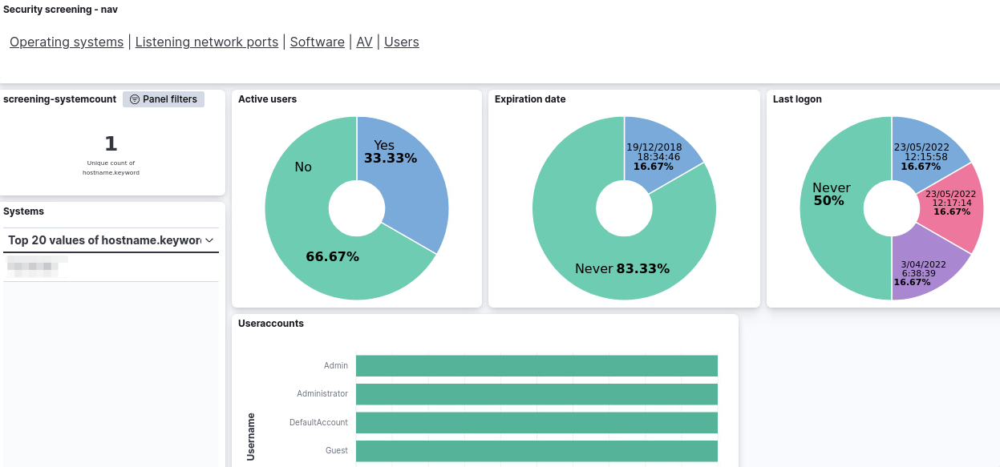

- [Security Onion for Security Screening](#security-onion-for-security-screening)
- [Prepare SecurityOnion for security screening](#prepare-securityonion-for-security-screening)
  - [Download ISO](#download-iso)
  - [Prepare VM](#prepare-vm)
  - [Install VM](#install-vm)
  - [Set the correct keyboard](#set-the-correct-keyboard)
  - [Install GUI for analyst](#install-gui-for-analyst)
  - [Firewall access](#firewall-access)
  - [Disable full packet capture](#disable-full-packet-capture)
  - [Ensure indexes are kept longer](#ensure-indexes-are-kept-longer)
- [Setup Processing environment](#setup-processing-environment)
  - [Security Onion sudo](#security-onion-sudo)
  - [Setup directory](#setup-directory)
  - [Transfer security-screening files to airgapped Security Onion](#transfer-security-screening-files-to-airgapped-security-onion)
  - [Directories](#directories)
  - [Install SMB client (optional)](#install-smb-client-optional)
  - [Python virtual environment](#python-virtual-environment)
  - [Create an Elastic API key](#create-an-elastic-api-key)
  - [Configuration file](#configuration-file)
  - [Elastic web interface](#elastic-web-interface)
  - [Enable the Python virtual environment](#enable-the-python-virtual-environment)
  - [Import the Kibana saved objects](#import-the-kibana-saved-objects)
  - [Chainsaw (optional)](#chainsaw-optional)
- [Processing of security screening files](#processing-of-security-screening-files)
  - [Process](#process)
  - [Monitor](#monitor)
  - [List and delete results](#list-and-delete-results)
  - [Misc](#misc)
- [Demo Elastic queries](#demo-elastic-queries)
- [Misc](#misc-1)
  - [Monitor a folder for new ZIP files with EVTX files](#monitor-a-folder-for-new-zip-files-with-evtx-files)
  - [Monitor a folder for new ZIP files with security adit files](#monitor-a-folder-for-new-zip-files-with-security-adit-files)
  - [Update settings in older setups](#update-settings-in-older-setups)
  - [Create security-screening-tools.zip](#create-security-screening-toolszip)

# Security Onion for Security Screening

Use Security Onion to represent data coming from a security screening. This will display the asset information from the auditscript, as well as import the most import Windows (EVTX) log files in Security Onion.



# Prepare SecurityOnion for security screening

## Download ISO

Download the latest ISO from [https://github.com/Security-Onion-Solutions/securityonion/blob/master/VERIFY_ISO.md](https://github.com/Security-Onion-Solutions/securityonion/blob/master/VERIFY_ISO.md) and verify its signature as described by Security Onion.

## Prepare VM

Setup a new VM with these specifications

- Guest OS family and version: Linux, **CentOS 7** (64-bit)
- 4 virtual cores
- Memory: Minimum **32GB** RAM
- Disk: Minimum **500GB** disk space
- Two network interfaces
- Point the CD-ROM to the ISO file

For the installation you also need
- One fixed IPv4 address
- A user account for Security Onion ('admin')
- A user account for the web interface of Security Onion (an e-mail address)

## Install VM

Choose the first option in the Security Onion installer and confirm the installation by pressing enter. After a few seconds you have to confirm this choice with **yes**. Provide an administrative user (for example `analyst`) and password. Note that the default keyboard layout is querty.

The initial install of the operating system only takes a couple of minutes after which you have to reboot. After the reboot login with the administrative user. This will start the Security Onion install.

Choose **Standalone** install, agree to the terms and provide a name (for example 'security-screening'). Select the management network interface and set a static IP (in CIDR notation).

Choose the **Airgapped** install and add an additional network interface for network monitoring. Choose Basic install, Zeek, and ETOpen and leave all other options to default. Then provide an administrator account for the Security Onion (Elastic) web interface. This needs to be in the form of an e-mail address. Access the interface via IP and set a password for the soremote user. Leave all settings to default. Provide the localhost (127.0.0.1/8) as an IP address to access the management interface. 

Completing this step of the installation can take a long time (approx. 1h).

After the installation reboot the system.

## Set the correct keyboard

Login on the console and then set the correct keyboard.

```
sudo loadkeys be
```

## Install GUI for analyst

Install the analyst GUI components with these commands. Note that if you have just rebooted Security Onion you might have to wait a couple of minutes for the web interface of the local web mirror (airgapped install) to become available.

```
sudo yum install gedit
sudo yum install gnome-terminal control-center
sudo yum install chromium
sudo yum install xorg-x11-utils xorg-x11-drivers
sudo yum install xorg-x11-proto-devel  xorg-x11-fonts-Type1 xorg-x11-font-utils
sudo yum install wireshark-gnome
```

Finally, update the setup to take into account the analyst (GUI) tools by running this command

```
sudo so-analyst-install
```

Reboot afterwards. Login and start the GUI with `startx`.

Set the default keyboard for the graphical user via the regional settings.

## Firewall access

Ensure you can access Security Onion (and Elastic) from your analyst workstation. You can update the firewall settings with 

```
sudo so-firewall
sudo so-allow

sudo so-firewall includehost analyst 1.2.3.4
```

## Disable full packet capture

You can disable full packet capture by disabling the **Stenographer** service.

```
sudo vi /opt/so/saltstack/local/pillar/global.sls
```

Add (or edit)

```
steno:
  enabled: false
```

You can manually force the service to stop with 

```
so-pcap-stop
```

## Ensure indexes are kept longer

Elasticsearch Curator curates Elasticsearch indices, meaning closing and deleting older indexes. For our purposes, it's necessary to set the close and delete to a longer period.

```
sudo vi /opt/so/saltstack/local/pillar/global.sls
```

Then change the close and delete setting for `so-beats` under the elasticsearch:index_settings section.

```
close: 550
delete: 730
```

Then restart curator.

```
sudo so-curator-restart
```

# Setup Processing environment

## Security Onion sudo

The processing of the data requires sudo permissions. As the root user add these lines to `/etc/sudoers`

```
sudo vi /etc/sudoers
```

```
analyst ALL=(root) NOPASSWD:/usr/sbin/so-import-evtx
analyst ALL=(root) NOPASSWD:/usr/bin/rm
```

## Setup directory

Create the `security-screening` directory in the `/nsm` directory and create a symlink pointing to the home directory.

```
sudo mkdir /nsm/security-screening
sudo ln -s /nsm/security-screening /home/analyst/security-screening
sudo chown analyst /nsm/security-screening
```

## Transfer security-screening files to airgapped Security Onion

1. Mount `security-screening.iso` ISO in VM
2. Copy tar.gz to new VM
3. Expand in `security-screening`
4. If needed, replace the references to the older username in the venv

```
cd /home/analyst/security-screening/securityonion/scripts/venv
find . -type f | xargs sed -i 's/olduser/analyst/g'
```

## Directories

Create a directory `input` and `output` in security-screening/securityonion

```
mkdir /home/analyst/security-screening/securityonion/input
mkdir /home/analyst/security-screening/securityonion/output
```

## Install SMB client (optional)

Install the SMB client to import screening data from a remote storage.

```
sudo rpm -i /home/analyst/security-screening/securityonion/ics/cifs/keyutils-1.5.8-3.el7.x86_64.rpm
sudo rpm -i /home/analyst/security-screening/securityonion/ics/cifs/cifs-utils-6.2-10.el7.x86_64.rpm
```

Create the future mount point

```
mkdir /nsm/security-screening/securityonion/smb/
```

## Python virtual environment 

**(requires Internet connection)**

Create the Python virtual environment

```
python3 -m venv venv
source venv/bin/active
```

Required libraries:
```
certifi 
chardet 
configparser
dataclasses 
elastic-transport 
elasticsearch 
hexdump
logger
lxml
more-itertools
pep8
pip 
pyparsing
python-evtx
setuptools
six
termcolor 
urllib3 
zipp
```


## Create an Elastic API key

Log in to Security Onion and go to Elastic. Under Stack Management, Security select **API keys** and click **Create API key**. Note down the API key, you need it to configure the processing script.

## Configuration file

Update `elasticsearch_api_key` in `config.py` with the previously created API key.

## Elastic web interface

Change the Elastic web interface to reflect your preferences. Within the Discover tab, click Options, View Discover Options.

- Enable **Document Explorer or classic view**
- Search for Dark Mode, disable **Dark mode**
- Change `timepicker:timeDefaults`
  ```
  {
  "from": "now-365d",
  "to": "now"
  }
  ```

## Enable the Python virtual environment

```
source /home/analyst/security-screening/securityonion/scripts/venv/bin/activate
```

Launch the script to create the Elastic index for the security screening.

```
python process-security-screening.py --createes confirm
```
(you can use *any text* instead of *confirm*)

Verify in Elastic that the index has been created under Stack Management, Index Management.

## Import the Kibana saved objects

Import the Kibana saved objects to have the different visualisations available. Under Stack Management, Kibana choose **Saved Objects**. Then click **Import**, select the file `screening_kibana_export.ndjson` and choose to check for existing objects and overwrite conflicts. Then click on **Import**.

Do the same for `screening_log_details_kibana_export.ndjson`.

Verify that the screening dashboard has been imported by going to Home, Analytics and choose **Dashboard**. Search for the security screenings dashbaoard.


## Chainsaw (optional)

Make sure that the full version of Chainsaw, including the detection rules, is in `security-screening/securityonion/chainsaw`. 

Fetch the latest version from [https://github.com/WithSecureLabs/chainsaw/releases/download/v2.3.1/chainsaw_all_platforms+rules+examples.zip](https://github.com/WithSecureLabs/chainsaw/releases/download/v2.3.1/chainsaw_all_platforms+rules+examples.zip).

Afterwards make sure that the Chainsaw binary is executable.

```
chmod +x security-screening/securityonion/chainsaw/chainsaw_x86_64-unknown-linux-mus
```

# Processing of security screening files

## Process

1. Upload the ZIP file in the folder **input**
2. Login to Security Onion
3. Navigate to security-screening/securityonion/scripts
   1. `cd security-screening/securityonion/scripts`
4. Execute the Python script
   1. `venv/bin/python process-security-screening.py --process ../input/audit_COMPUTER.zip`

Different options for processing

- `process`
  - Input: ZIP file name
  - Actions:
    - Extract ZIP
    - Read Windows logs
    - Read screening files
    - (opt) Execute Chainsaw
    - Delete extracted files (if `keep_output_files` is set to False)
- `processfolder`
  - Input: foldername
  - Actions:
    - Read Windows logs
    - Read screening files
    - (opt) Execute Chainsaw
    - *Does not delete extracted files*
- `processevtx`
  - Input: ZIP file name
  - Actions:
    - Extract ZIP
    - Set path to Windows log file with setting from `processevtx_logfolder`
    - Read Windows logs
    - Delete extracted files

## Monitor

Monitor a directory for new files

- `monitornew`
  - Input: foldername
  - Actions:
    - Read state from `import_state_file`
    - Read all files ending in *.zip
    - Check if changed time is newer than state file
      - If newer, then run `process`
    - Update state
- `monitornewevtx`
  - Input: foldername
  - Actions:
    - Read state from `import_state_file`
    - Read all files ending in *.zip
    - Check if changed time is newer than state file
      - If newer, then run `processevtx`
    - Update state 
- `monitornewfolder`
  - Input: foldername
  - Actions:
    - Read state from `import_state_file`
    - Read all updated folders in foldername
    - Used for 'extracted' versions
    - Check if changed time is newer than state file
      - If newer, then run `processfolder`
    - - Update state

## List and delete results

- `listscreening`
  - Input: "go"
- `listscreeninglogs`
  - Input: "go"
- `deletelogs`
  - `venv/bin/python process-security-screening.py --deletelogs FQDN`
  - Input FQDN
  - Actions:
    - Delete logs for FQDN
- `deletescreening`
  - `venv/bin/python process-security-screening.py --deletescreening HOSTNAME`
  - Input hostname
  - Actions:
    - Delete screening data for hostname

## Misc

- `report`
  - Input: ZIP file name
  - Actions:
    - Extract ZIP
    - Process audit files (system, software, network, users, av)
- `deletematchinglogs`:
  - Input EVTX file
  - Actions:
    - Delete logs matching system names in evtx file
  - Can result in `elastic_transport.ConnectionTimeout: Connection timed out` when there's a lot of data, just try a second time
- `purgelogsscreening`
  - Input: *random string*
  - Actions:
    - Purge logs and screening data. Purging is limit to `elasticsearch_max_results`. You might have to run it a few times to delete all data.

# Demo Elastic queries

Review the Windows logs under Home, Analytics, **Discover**. Make sure to select the view **\*:so-\*** and select the correct time frame (for example the last year.) 

You can then use queries in Elastic.

* New users created: `winlog.event_id:4720`
* Logs cleared `winlog.event_id:1102`
* Group membership changes `winlog.event_id:4732`
* RDP logins `winlog.event_id:4624 AND winlog.event_data.LogonType:10`
* Failed logins `winlog.event_id:4625`
* Account locked `winlog.event_id:4740`
* Executed PowerShell `winlog.event_id:4104`
* New service installed `winlog.event_id:4697`

# Misc

## Monitor a folder for new ZIP files with EVTX files

- Mount SMB directory
  - `sudo mount -t cifs -o username=joe //1.2.3.4/screening /nsm/security-screening/securityonion/smb/`
- Execute cronjob after files are copied to the SMB directory
  - `00 5 * * * cd /home/analyst/security-screening/securityonion/scripts/ ; /home/analyst/security-screening/securityonion/scripts/venv/bin/python process-security-screening.py --monitornewevtx /nsm/security-screening/securityonion/smb`

Config:
```
    "always_import": True,
    "import_state_file": "/nsm/security-screening/securityonion/scripts/import_state.float",
    "always_delete_outputfiles": True,
    "processevtx_logfolder": "logs_copy",
    "deletematchinglogs": False,
```

## Monitor a folder for new ZIP files with security adit files

- Mount SMB directory
  - `sudo mount -t cifs -o username=joe //1.2.3.4/screening /nsm/security-screening/securityonion/smb/`
- Execute cronjob after files are copied to the SMB directory
  - `00 5 * * * cd /home/analyst/security-screening/securityonion/scripts/ ; /home/analyst/security-screening/securityonion/scripts/venv/bin/python process-security-screening.py --monitornew /nsm/security-screening/securityonion/smb`

Config:
```
    "always_import": True,
    "import_state_file": "/nsm/security-screening/securityonion/scripts/import_state.float",
    "always_delete_outputfiles": True,
    "processevtx_logfolder": False, 
    "deletematchinglogs": False,
```
## Update settings in older setups

- Change `timepicker:timeDefaults`
- Change curator settings

## Create security-screening-tools.zip

- Create a tar.gz of the data
- `tar -zcvf /home/analyst/security-screening.tar.gz security-screening`
- Create the ISO file
- `mkisofs -o security-screening-tools.iso security-screening.tar.gz`